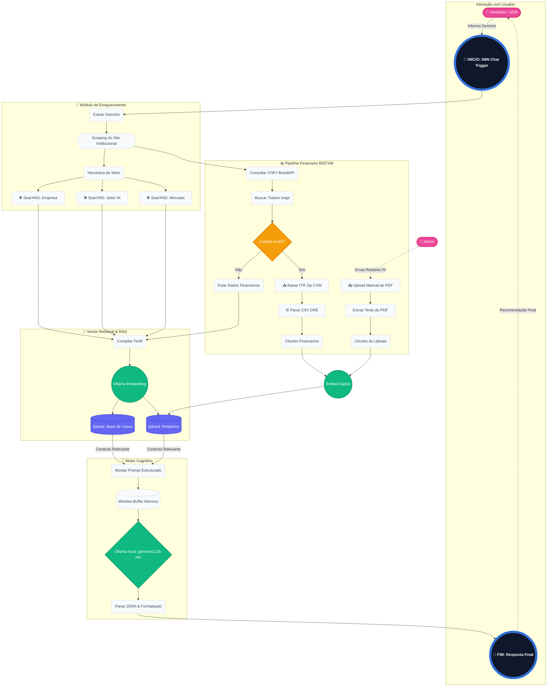

# AI SDR — Agente de Qualificação de Leads

MVP de um **agente de IA para pré-venda (SDR)** que qualifica leads de uma consultoria,
distinguindo demandas de **GenAI real** de casos melhor resolvidos por **RPA, BI ou automação
clássica** — reduzindo o tempo de consultores sêniores e melhorando o dimensionamento de propostas.

> Trabalho acadêmico — **MBA em AI Leadership / FIAP**.
> Status: **rascunho inicial** (definição de escopo).

## O que o agente faz (MVP)

O vendedor informa apenas o **domínio do prospect** (ex.: `itau.com.br`) no chat. O agente então:

1. Faz **research/enriquecimento** automático sobre a empresa a partir do domínio (site
   institucional, notícias, vagas de emprego, sinais de maturidade digital)
2. Recupera **cases relevantes** da consultoria via RAG
3. **Classifica** a demanda mais provável: `GenAI real` | `RPA` | `BI` | `automação clássica`
4. Estima o **nível de maturidade em IA** do prospect
5. Recomenda o **direcionamento de estratégia**: manter a abordagem que o prospect já propôs vs.
   sugerir um *shift*, e se é necessário um discovery mais profundo
6. Sugere **perguntas de discovery** adaptadas ao que já foi levantado na pesquisa

O vendedor sempre revisa a recomendação — **human-in-the-loop**.

## Arquitetura do Agente

O diagrama abaixo ilustra o fluxo técnico do agente, agrupando os processos em módulos lógicos.



## Documentação

- [`docs/genai-canvas.md`](docs/genai-canvas.md) — GenAI Canvas (transcrição do artefato original)
- [`docs/mvp-scope.md`](docs/mvp-scope.md) — Revisão crítica do canvas, pivot de stack e escopo do MVP
- [`docs/llm-output-schema.md`](docs/llm-output-schema.md) — Schema JSON da saída do LLM (classificação estruturada)
- [`n8n/workflows/README.md`](n8n/workflows/README.md) — Workflow do N8N: como abrir, ativar e testar

## Stack

| Camada        | Ferramenta                                              |
|---------------|----------------------------------------------------------|
| Orquestração  | N8N (workflow: research → RAG → LLM → resposta)         |
| LLM           | Ollama, modelo local `gemma4:12b-mlx` |
| Interface     | Chat nativo do N8N (node "Chat - Recebe Prompt")        |
| Research      | SearXNG self-hosted + scraping do site do prospect + dados abertos da CVM (empresas B3) |
| RAG           | Qdrant (vector store da base de cases + relatórios financeiros), via node do N8N |

**Fora do MVP (Fase 2):** transcrição de calls (Whisper), integração com CRM.

## Como rodar

Pressupõe Ollama já disponível localmente (fora deste compose). Sobe **N8N**,
**SearXNG** e **Qdrant**:

```bash
docker compose up -d
```

| Serviço | URL (do host) | URL (de dentro do N8N) |
|---|---|---|
| N8N        | http://localhost:5678 | — |
| SearXNG    | http://localhost:8080 | `http://searxng:8080` |
| Qdrant     | http://localhost:6333 | `http://qdrant:6333`  |
| Ollama     | http://localhost:11434 | `http://host.docker.internal:11434` |

Criar a collection do Qdrant para a base de cases (768 dimensões, compatível com o modelo de
embedding `embeddinggemma` do Ollama) e indexar os 20 cases curados:

```bash
curl -X PUT "http://localhost:6333/collections/ai_sdr_cases" \
  -H "Content-Type: application/json" \
  -d '{"vectors": {"size": 768, "distance": "Cosine"}}'

pip install -r requirements.txt
python3 scripts/ingest_cases.py
```

Por fim, siga [`n8n/workflows/README.md`](n8n/workflows/README.md) para completar o setup inicial
do N8N (criar sua conta de owner), ativar o workflow **"AI SDR - Qualificação de Leads"** (já
importado) e testar pelo painel de chat nativo do próprio N8N.

## Base de conhecimento (RAG)

[`data/cases/`](data/cases/README.md) contém 20 cases pesquisados e curados (11 reais e
documentados publicamente + 9 cenários compostos claramente identificados) que ensinam o agente
a distinguir GenAI real de RPA/BI/automação clássica. Já indexados no Qdrant.

## Workflow N8N

- [`n8n/workflows/ai-sdr-qualification.json`](n8n/workflows/ai-sdr-qualification.json) — pipeline
  completo (chat → research → RAG → Ollama/Gemma com memória por sessão → resposta), já importado
  no seu N8N local
- [`n8n/schemas/llm-output.schema.json`](n8n/schemas/llm-output.schema.json) — schema JSON usado
  na chamada estruturada ao Gemma (ver [`docs/llm-output-schema.md`](docs/llm-output-schema.md))

## Estrutura

```
.
├── README.md
├── docker-compose.yml   # N8N + SearXNG + Qdrant
├── requirements.txt     # dependências Python (scripts utilitários)
├── .env.example         # variáveis de ambiente (sem segredos)
├── .gitignore
├── data/
│   └── cases/           # 20 cases curados (base de conhecimento do RAG)
├── scripts/
│   └── ingest_cases.py  # gera embeddings (Ollama) e indexa os cases no Qdrant
├── searxng/
│   └── settings.yml     # habilita formato JSON (consumido pelo N8N)
├── n8n/
│   ├── workflows/
│   │   ├── ai-sdr-qualification.json  # pipeline completo (58 nodes, incluindo CVM/B3, upload manual e notas adesivas)
│   │   └── README.md                  # como abrir, ativar e testar
│   └── schemas/
│       └── llm-output.schema.json     # schema JSON da saída do Gemma
└── docs/
    ├── genai-canvas.md         # canvas original (rascunho)
    ├── mvp-scope.md            # revisão + escopo do MVP
    └── llm-output-schema.md    # schema JSON documentado com exemplo
```
